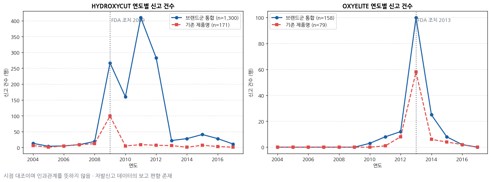
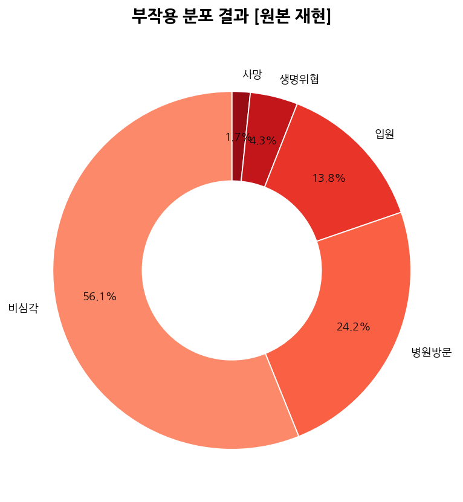
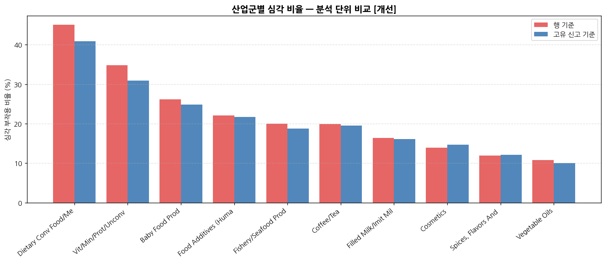

# FDA 식품 이상사례 신고 분석 — 재현과 검증

미국 FDA의 식품 부작용 자발신고 데이터(CAERS, 90,786건)를 다룬 팀 프로젝트를 **처음부터 다시 실행해 검증하고, 지표 정의의 문제를 찾아 기록**한 저장소입니다.

팀 프로젝트에서는 운영 총괄과 **브랜드 사례 심층 분석**, 발표를 담당했습니다. 이 저장소의 재현·감사 작업은 프로젝트 종료 후 개인 단독으로 수행했습니다.

---

## 1. 문제 정의

**신고 건수가 많다는 것이 곧 위험을 뜻하지는 않습니다.**

자발신고 데이터에서는 언론에 보도된 제품, 사용자가 많은 제품, 신고 절차를 아는 소비자층이 쓰는 제품일수록 신고가 몰립니다. 그렇다면 어떤 신고 패턴이 실제 문제와 연결되는가 — 이것이 담당 파트의 질문이었습니다.

접근은 두 단계입니다.

1. **데이터 안에서** 심각 부작용 비율이 높은 브랜드를 찾고 시계열 추이를 확인한다
2. **데이터 밖에서** 그 시기에 실제로 규제 조치가 있었는지 대조한다

---

## 2. 데이터

| 항목 | 값 |
|---|---|
| 출처 | FDA CAERS (CFSAN Adverse Event Reporting System) |
| 기간 | 2004-01-01 ~ 2017-06-30 |
| 규모 | 90,786행 · 12컬럼 |
| **고유 신고 번호** | **64,517건** |
| 분석 단위 | 신고 1건에 등록된 제품 1개 = 1행 |

원본은 저장소에 포함하지 않습니다. 내려받는 방법과 컬럼 구조는 [`data/README.md`](data/README.md)를 참고하세요.

### 이 데이터의 함정

전체 행(90,786)과 고유 신고(64,517)가 다릅니다. 한 신고에 여러 제품이 등록되면 그 수만큼 행이 늘어나는데, **부작용 결과는 신고 단위로 부여되어 모든 행에 복제**됩니다.

| 다중 행 신고 안에서 값이 2종 이상인 비율 | |
|---|---:|
| 제품명 | 99.7% |
| 제품 역할 | 62.8% |
| 산업군 | 25.0% |
| **부작용 결과** | **0.0%** |

제품 6개가 등록된 신고 1건은 사망 1건이 아니라 **6건으로 계산됩니다.** 이 차이가 뒤에 나오는 모든 비율에 영향을 줍니다.

---

## 3. 브랜드 사례 심층 분석

담당 파트입니다. 팀의 데이터 분석 단계가 끝난 뒤 개인적으로 추가 진행했습니다.

### 절차

| 단계 | 방법 |
|---|---|
| 1. 브랜드 선별 | 신고 건수 × 심각 비율 산점도에서 우상단 영역을 **육안으로 판별** |
| 2. 추이 확인 | 선별 브랜드의 연도별 신고 건수 추이 작성 |
| 3. 급증 시기 특정 | 추이 그래프에서 급증 구간을 **육안으로 판별** |
| 4. 외부 대조 | 해당 시기의 규제기관 조치·보도자료 검색 후 시점 대조 |

**통계적 이상치 탐지가 아닙니다.** 탐색적 분석에서 통상적인 시각적 선별이며, 이 저장소의 사후 검증에서도 두 브랜드는 IQR·robust z 기준을 넘지 않습니다([상세](docs/reproduction_audit.md#6-브랜드-선별-방법)).

### 결과



**OXYELITE PRO** — FDA는 2013년 10월 경고 후 11월 9일 회수 조치를 시행했습니다.

| 연도 | 2011 | 2012 | **2013** | 2014 | 2015 |
|---|---:|---:|---:|---:|---:|
| 신고 | 8 | 12 | **100** | 25 | 8 |

조치 전년 대비 **8.3배** 증가했고, 2013년이 최대 신고 연도입니다. 조치 연도와 신고 급증 연도가 겹칩니다.

**HYDROXYCUT** — FDA는 간독성 문제로 2009년 5월 자발적 회수를 진행했습니다.

| 연도 | 2008 | **2009** | 2010 | **2011** | 2012 |
|---|---:|---:|---:|---:|---:|
| 신고 | 19 | **267** | 160 | **410** | 283 |

조치 연도에 **14배** 증가했지만, **최대 신고 연도는 2011년**입니다. 회수 이후에도 2년간 높은 신고가 이어졌습니다.

### 해석의 한계

**시점의 일치는 인과관계가 아니라 외부 사건과의 시간적 대조입니다.**

- 신고 급증은 실제 피해 증가와 같지 않습니다
- 언론 보도 이후 신고가 늘어나는 **보고 편향**이 존재합니다. HYDROXYCUT의 최대치가 회수 2년 뒤에 나타난 것도 이 효과로 설명될 수 있습니다
- 신고 데이터에는 판매량이 반영되지 않아 노출량 대비 위험도를 알 수 없습니다
- Concomitant(병용) 제품이 포함돼 있어, 특정 브랜드의 신고가 그 브랜드로 인한 부작용을 뜻하지 않습니다

두 사례의 조치 시점과 근거 문서는 [`results/external_validation.csv`](results/external_validation.csv)에 정리했습니다.

---

## 4. 재현과 검증

프로젝트 종료 후, 팀 분석 전체를 다시 실행해 발표 자료의 수치와 대조했습니다.

### 재현된 항목

계산 자체는 정확했습니다.

| 항목 | 발표 자료 | 재현값 |
|---|---:|---:|
| 연령 4구간 | 2,964 / 3,007 / 26,045 / 20,890 | 완전 일치 |
| 심각 부작용 행 수 | — | 21,966행 (24.20%) |
| Dietary Conv 심각비율 | 45.1% | 45.07% |
| Vit/Min 심각비율 | 34.8% | 34.77% |
| Cosmetics 심각비율 | 14.0% | 13.98% |

### 찾아낸 문제

문제는 계산이 아니라 **계산 결과를 문장으로 옮기는 단계**에 몰려 있었습니다.

#### 43.9%의 분모

발표 자료의 "전체 부작용 신고 중 약 43.9%가 심각한 결과를 동반"이라는 문장은 도넛 차트에서 나왔습니다.



| 슬라이스 | 행 수 |
|---|---:|
| 사망 · 생명위협 · 입원 | 24,210 |
| 병원방문 | 29,652 |
| 비심각 | 68,820 |
| **분모(합계)** | **122,682** |

분모가 전체 행 수 90,786보다 **31,896 많습니다.** 한 신고가 입원과 병원방문을 동시에 가지면 두 번 계산되기 때문입니다. 게다가 팀이 정의한 심각(사망·입원·생명위협)에 없는 **병원방문이 포함**돼 있어, 43.9% 중 24.2%p가 이 항목입니다.

**중복 없이 계산하면 이렇습니다.**

| 방식 | 값 |
|---|---:|
| 행 단위 | **24.20%** (21,966 / 90,786) |
| 신고 단위 | **19.72%** (12,720 / 64,517) |

#### 분석 단위에 따른 차이



모든 그래프가 행 기준이었고, 고유 신고 기준을 쓴 그래프는 없었습니다.

| 지표 | 행 기준 | 신고 기준 | 차이 |
|---|---:|---:|---:|
| 전체 심각도 | 24.20% | 19.72% | −4.48%p |
| Dietary Conv | 45.07% | 40.89% | −4.18%p |
| Vit/Min | 34.77% | 30.91% | −3.86%p |
| Cosmetics | 13.98% | 14.70% | +0.73%p |

건강기능식품은 한 신고에 여러 제품을 등록하는 경우가 많아(1.73배) 행 기준에서 과대 계상됩니다. 상위 10개 순위도 바뀝니다.

#### 브랜드 표본 누락

`HYDROXYCUT` 을 포함하는 제품명은 245종 1,300행이지만, 분석에 들어간 것은 정확히 일치하는 **171행(13.2%)** 뿐이었습니다. 나머지는 `HYDROXYCUT REGULAR RAPID RELEASE CAPLETS`(327행) 등으로 흩어져 표본 하한에서 탈락했습니다.

문자열 패턴으로 통합하면 심각 비율이 **55.0% → 37.5%** 로 내려갑니다.

#### 연령 구간 이원화

같은 발표 자료 안에서 파이 차트와 스택바가 서로 다른 연령 정의를 썼습니다. `pd.cut(right=True)` 때문에 **0세 1,212행이 통째로 탈락**하고 경계가 한 칸씩 밀렸습니다. 라벨 `노인(66+)` 도 실제 구간은 `(60, 120]` 입니다.

| 구간 | 파이 차트 | 스택바 |
|---|---:|---:|
| 영유아 | 2,964 | **2,007** |
| 합계 | 52,906 | **51,694** |

전체 목록은 [`docs/discrepancy_report.md`](docs/discrepancy_report.md)에 있습니다.

---

## 5. 담당 범위

5인 팀 프로젝트 · 2026.04.02–2026.04.08

| 구분 | 내용 |
|---|---|
| **팀 프로젝트** | 운영 총괄 · **브랜드 사례 심층 분석** · 발표 |
| **본 저장소** | 전 과정 재현·검증 및 개선안 설계 |

데이터 전처리, EDA, 인사이트 해석, 발표 자료 제작은 팀 공동 작업입니다.

---

## 6. 실행 방법

```bash
pip install -r requirements.txt
# data/README.md 안내에 따라 CAERS 원본을 data/ 에 배치
jupyter lab
```

| 노트북 | 내용 |
|---|---|
| [`01_original_reproduction.ipynb`](notebooks/01_original_reproduction.ipynb) | 팀 분석 로직을 **그대로** 실행. 버그도 수정하지 않음 |
| [`02_improved_verification.ipynb`](notebooks/02_improved_verification.ipynb) | 개선 정의 적용, 외부 검증, 검증 CSV 5종 생성 |

원본 CSV 경로만 지정하면 처음부터 실행되며, `results/` 의 CSV 5개와 `figures/` 의 그래프 8장이 전부 재생성됩니다. 저장소 루트와 `notebooks/` 어느 쪽에서 실행해도 같은 위치에 저장됩니다.

노트북은 출력을 지운 소스 상태로 커밋돼 있습니다. 저장소에 포함된 결과물이 실행 결과입니다.

---

## 7. 저장소 구조

```
fda-caers-adverse-event-analysis/
├─ notebooks/     원본 재현 / 개선 검증 노트북
├─ docs/          재현·검증 기록
├─ results/       검증 산출물 CSV 5종
├─ figures/       그래프 8장 (orig 5 · imp 3)
└─ data/          스키마 샘플과 내려받기 안내 (원본 미포함)
```

### 문서

| 파일 | 내용 |
|---|---|
| [`reproduction_audit.md`](docs/reproduction_audit.md) | 재현·검증 기록 — 데이터 단위, 전처리, 심각도 정의, 산업군, 브랜드, 외부 검증 |
| [`discrepancy_report.md`](docs/discrepancy_report.md) | 발표 자료와 재현 결과의 차이 7건 |

### 검증 산출물

| 파일 | 내용 |
|---|---|
| `metric_comparison.csv` | 23개 항목 × 주장 / 재현값 / 개선값 / 일치 여부 / 차이 원인 |
| `data_unit_sensitivity.csv` | 15개 지표 × 행 / 고유신고 / Suspect(행) / Suspect(신고) |
| `brand_name_normalization.csv` | 6개 브랜드군 통합 전후와 매칭 제품명 수 |
| `external_validation.csv` | FDA 조치 시점과 연도별 신고 건수 대조 |
| `improved_summary.csv` | 원본 대비 개선 요약 |

---

## 8. 한계

- **자발신고 데이터입니다.** 신고 건수는 발생 건수가 아니며, 판매량(노출량)이 반영되지 않아 브랜드 간 위험도를 직접 비교할 수 없습니다.
- **인과를 규명하지 않습니다.** 신고 급증과 규제 조치의 시점 대조일 뿐이며, 보고 편향으로 설명될 수 있는 부분이 큽니다.
- **심각도 정의가 좁습니다.** 이 분석은 팀 정의(사망·입원·생명위협)를 유지했습니다. FDA CAERS 자체 기준은 장애·선천 이상·중재 필요 등을 포함해 더 넓습니다.
- **브랜드군 통합은 규칙 기반입니다.** 공인 브랜드 사전이 아니라 문자열 포함 검사이므로, 표기가 크게 다르면 누락되고 같은 문자열을 포함한 다른 브랜드는 과대 포함될 수 있습니다. 기존 분석의 표본 누락 규모를 확인하는 감사 목적으로만 사용했습니다.
- **IQR·robust z 비교는 보조 검증입니다.** 브랜드별 표본이 20행에서 수백 행까지 달라 표본 수를 보정하지 않은 비율 간 비교이며, 위험 브랜드 판정 기준이 아닙니다.
- **2017년은 부분 연도**(Q2까지)이므로 연도별 추이에서 마지막 구간은 낮게 나타납니다.

---

## 9. 사용 기술

Python · pandas · numpy · matplotlib · Jupyter
