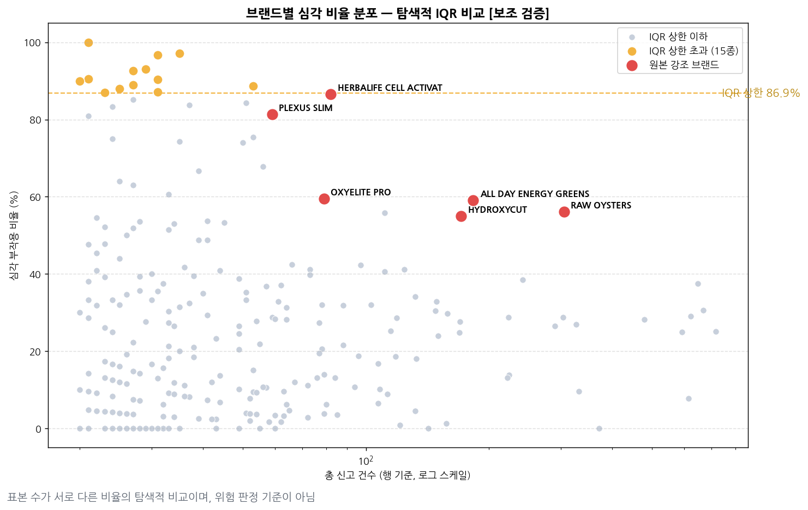

# 재현 및 검증 기록

팀 프로젝트의 분석을 처음부터 다시 실행해 발표 자료의 수치와 대조하고, 지표 정의를 점검한 기록입니다.

데이터: `CAERS_ASCII_2004_2017Q2.csv` (90,786행 × 12컬럼)
노트북: [`01_original_reproduction.ipynb`](../notebooks/01_original_reproduction.ipynb) · [`02_improved_verification.ipynb`](../notebooks/02_improved_verification.ipynb)

---

## 1. 재현 결과 요약

| 항목 | 결과 |
|---|---|
| 연령대 4구간 (2,964 / 3,007 / 26,045 / 20,890) | 완전 일치 |
| 심각 부작용 행 수·비율 (21,966행 · 24.20%) | 완전 일치 |
| 산업군 상위 심각 비율 (45.07% / 34.77% / 13.98%) | 완전 일치 |
| 브랜드 선별 조건 (20행 이상 → 상위 80개) | 완전 일치 |
| 전체 신고 중 심각 비율 43.9% | **산출 방식 재검토 필요** |

계산 자체는 정확히 재현됐습니다. 검토가 필요했던 것은 **비율의 분모 정의**였습니다.

---

## 2. 데이터 단위 — 행과 신고는 다르다

전체 90,786행이지만 고유 신고 번호는 **64,517건**입니다. 한 신고에 여러 제품이 등록되면 그 수만큼 행이 늘어납니다.

다중 행 신고 10,817건의 내부를 확인하면 원인이 분명합니다.

| 항목 | 신고 내에서 값이 2종 이상인 비율 |
|---|---:|
| 제품명 | 99.7% |
| 제품 역할 (Suspect / Concomitant) | 62.8% |
| 산업군 | 25.0% |
| **부작용 결과** | **0.0%** |

**`AEC_One Row Outcomes` 는 신고 단위로 부여되어 모든 제품 행에 복제됩니다.** 제품 6개가 등록된 신고 1건은 사망 1건이 아니라 6건으로 계산됩니다.

### 분석 단위별 심각도

| 기준 | 관측 수 | 심각 | 비율 |
|---|---:|---:|---:|
| 행 기준 | 90,786 | 21,966 | **24.20%** |
| 고유 신고 기준 | 64,517 | 12,720 | **19.72%** |
| Suspect 행 기준 | 74,558 | 17,192 | 23.06% |
| Suspect 고유 신고 | 64,476 | 12,711 | 19.71% |

행 기준과 신고 기준의 차이가 **4.48%p** 입니다. Suspect 한정 여부보다 **행/신고 단위 선택이 결과에 훨씬 크게 작용합니다.**

전체 결과는 [`results/data_unit_sensitivity.csv`](../results/data_unit_sensitivity.csv)에 있습니다.

---

## 3. 43.9%의 분모 검증

발표 자료의 "전체 부작용 신고 중 약 43.9%가 심각한 결과를 동반"이라는 수치는 도넛 차트에서 산출됐습니다.


| 슬라이스 | 행 수 |
|---|---:|
| 사망 | 2,028 |
| 생명위협 | 5,274 |
| 입원 | 16,908 |
| 병원방문 | 29,652 |
| 비심각 | 68,820 |
| **합계 (분모)** | **122,682** |

**분모가 전체 행 수 90,786보다 31,896 많습니다.** 한 신고가 입원과 병원방문을 동시에 가지면 두 번 계산되기 때문입니다.

추가로 두 가지를 확인했습니다.

**① 심각 정의와 슬라이스 구성이 다릅니다.** `serious` 는 사망·입원·생명위협 3종으로 정의했는데, 도넛에는 병원방문 29,652행이 포함돼 있습니다. 43.9% 중 24.2%p가 이 항목입니다.

**② '응급실' 슬라이스가 그래프에 없습니다.** `'EMERGENCY'` 로 검색했으나 CAERS의 실제 표기는 `VISITED AN ER` 이라 매칭이 0건이며, `data_counts[data_counts > 0]` 필터에서 제거됐습니다. 한편 `'DOCTOR|VISIT'` 은 `VISITED AN ER`(12,890)과 `VISITED A HEALTH CARE PROVIDER`(20,158)를 둘 다 잡아 29,652행이 됩니다. 응급실 방문이 '병원방문'에 흡수된 상태입니다.

### outcome 어휘 실측

`AEC_One Row Outcomes` 에 실제로 등장하는 항목은 12종이며 결측은 0건입니다.

| 항목 | 행 수 | 비율 |
|---|---:|---:|
| OTHER SERIOUS (IMPORTANT MEDICAL EVENTS) | 36,837 | 40.58% |
| NON-SERIOUS INJURIES/ ILLNESS | 27,835 | 30.66% |
| VISITED A HEALTH CARE PROVIDER | 20,158 | 22.20% |
| HOSPITALIZATION | 16,908 | 18.62% |
| VISITED AN ER | 12,890 | 14.20% |
| LIFE THREATENING | 5,274 | 5.81% |
| SERIOUS INJURIES/ ILLNESS | 3,606 | 3.97% |
| REQ. INTERVENTION TO PRVNT PERM. IMPRMNT. | 2,944 | 3.24% |
| DISABILITY | 2,890 | 3.18% |
| DEATH | 2,028 | 2.23% |
| NONE | 145 | 0.16% |
| CONGENITAL ANOMALY | 77 | 0.08% |

항목별 보유율을 단순 합산하면 100%를 넘습니다. 한 신고가 여러 결과를 동시에 가질 수 있기 때문입니다.

### 사용 가능한 표현

"전체 신고 중 XX%가 심각" 형태의 문장에는 **중복 없는 단위**만 쓸 수 있습니다.

> 전체 **신고** 64,517건 중 19.7%가 사망·입원·생명위협을 동반했다.
> 전체 **행** 90,786건 중 24.2%가 사망·입원·생명위협을 동반했다.

> **참고** — FDA CAERS 자체 기준의 serious 범주는 이 분석의 정의보다 넓습니다(DISABILITY, CONGENITAL ANOMALY, REQ. INTERVENTION, OTHER SERIOUS 등 포함). 좁은 정의를 쓰는 것 자체는 문제가 아니지만, "심각"의 범위를 명시해야 합니다.

---

## 4. 전처리 검증

### 연령 단위 통일

원본 `convert_age()` 를 그대로 실행한 결과가 발표 자료 수치와 완전히 일치합니다.

| 연령대 | 재현값 | 발표 자료 |
|---|---:|---:|
| 영유아(0-5) | 2,964 | 2,964 |
| 청소년(6-19) | 3,007 | 3,007 |
| 성인(20-59) | 26,045 | 26,045 |
| 노인(60+) | 20,890 | 20,890 |

연령 유효 52,906행은 전체의 58.3%입니다. **연령 관련 그래프의 분모가 전체가 아니라는 점**을 함께 표기해야 합니다.

### 구간 정의가 두 곳에서 다름

파이 차트와 스택바가 서로 다른 방식으로 연령을 구간화합니다.

| | 함수 방식 (파이 차트) | `pd.cut` 방식 (스택바) |
|---|---:|---:|
| 영유아 | 2,964 | **2,007** |
| 청소년 | 3,007 | 3,058 |
| 성인 | 26,045 | 26,692 |
| 노인 | 20,890 | 19,937 |
| 합계 | 52,906 | **51,694** |

`pd.cut(bins=[0,6,20,60,120])` 은 기본값 `right=True` 이므로 구간이 `(0,6]` 입니다. **0세 1,212행이 어느 구간에도 속하지 않고 탈락**하며, 6세는 영유아로, 20세는 청소년으로, 60세는 성인으로 한 칸씩 밀립니다.

라벨 `노인(66+)` 도 실제 구간 `(60, 120]` 과 일치하지 않습니다.

### 개선안

```python
per_year = {'Day(s)':365.25, 'Week(s)':52.18, 'Month(s)':12.0,
            'Year(s)':1.0, 'Decade(s)':0.1}
y = age / per_year[unit]        # 절삭 없음

pd.cut(y, bins=[0, 6, 20, 60, 120.000001],
       labels=['영유아(0-5)', '청소년(6-19)', '성인(20-59)', '노인(60+)'],
       right=False, include_lowest=True)
```

`right=False` 로 라벨과 실제 경계를 일치시켰습니다.

| 입력 | 분류 |
|---|---|
| 0세 · 5.5세 | 영유아(0-5) |
| 6세 · 19.9세 | 청소년(6-19) |
| 20세 · 59.9세 | 성인(20-59) |
| 60세 · 120세 | 노인(60+) |

**결과** — 연속 환산값은 1,544행에서 달라지지만(Month 1,236 / Week 174 / Day 134), **4구간 집계는 원본과 완전히 동일합니다.** 이 데이터에서는 환산 방식 개선이 연령대 분류를 바꾸지 않으며, 개선의 실익은 연속 연령값을 쓰는 분석에 한정됩니다.

---

## 5. 산업군 — 분석 단위에 따른 차이

조건 `표본 100건 이상` → 심각 비율 상위 10개입니다.


| 산업군 | 행 % | 고유 신고 % | 차이 |
|---|---:|---:|---:|
| Dietary Conv Food/Meal | 45.07 | 40.89 | **−4.18** |
| Vit/Min/Prot/Unconv Diet | 34.77 | 30.91 | **−3.86** |
| Baby Food Prod | 26.19 | 24.87 | −1.32 |
| Fishery/Seafood Prod | 20.03 | 18.78 | −1.24 |
| Cosmetics | 13.98 | 14.70 | +0.73 |

건강기능식품은 한 신고에 여러 제품을 함께 등록하는 경우가 많아(48,501행 → 28,061신고, 1.73배) 행 기준에서 과대 계상됩니다. 화장품은 신고당 제품 수가 적어(1.09배) 오히려 소폭 상승합니다.

상위 10 순위도 바뀝니다. 행 기준 10위 `Vegetable Oils` 가 빠지고 `Beverage Bases/Conc/Nectar` 가 들어옵니다.

**수치 자체는 재현되므로 사용 가능하되, "행 기준"임을 명시해야 합니다.** 명시 없이 "45.1%"라고 쓰면 "신고 100건 중 45건"으로 읽히는데 실제로는 40.9건입니다.

---

## 6. 브랜드 선별 방법

### 선별 절차

브랜드 사례 심층 분석은 다음 절차로 수행했습니다.

| 단계 | 방법 |
|---|---|
| 1. 브랜드 선별 | 신고 건수 × 심각 비율 산점도에서 우상단 영역을 **육안으로 판별** |
| 2. 추이 확인 | 선별 브랜드의 연도별 신고 건수 추이 작성 |
| 3. 급증 시기 특정 | 추이 그래프에서 급증 구간을 **육안으로 판별** |
| 4. 외부 대조 | 해당 시기의 규제기관 조치 자료와 시점 대조 |

**통계적 이상치 탐지가 아닙니다.** 탐색적 분석에서 통상적인 시각적 선별이며, 코드에 적용된 연산은 표본 하한(20행 이상), 신고량 상위 80개 추출, 중앙값 보조선(시각 요소), 라벨 표시 목록 네 가지입니다.

### 사후 검증 — 통계적 이상치에 해당하는가

표현의 정확성을 확인하기 위해 IQR과 robust z-score를 계산했습니다. **보조 검증이며 위험 브랜드 판정 기준이 아닙니다.**



전체 브랜드 286종의 심각비율 분포는 Q1 4.4 / 중앙 19.4 / Q3 37.4이며, IQR 상한은 86.9%입니다.

| 브랜드 | 심각비율 | 전체 286종 IQR | Vit/Min 200종 IQR | robust z |
|---|---:|:---:|:---:|---:|
| HERBALIFE CELL ACTIVATOR | 86.6% | X | **O** | 2.93 |
| PLEXUS SLIM | 81.4% | X | X | 2.70 |
| OXYELITE PRO | 59.5% | X | X | 1.75 |
| HYDROXYCUT | 55.0% | X | X | 1.55 |

**심층 분석 대상 두 브랜드는 어떤 기준으로도 통계적 이상치가 아닙니다.** robust z가 1.5~1.75로 임계값 3.5에 크게 못 미칩니다. 브랜드별 심각 비율이 0%~100%로 넓게 분포해 55~60%는 상위권일 뿐입니다.

> 표본 수가 20행에서 수백 행까지 크게 다르므로 표본 수를 보정하지 않은 비율 간 비교입니다. 자발신고 데이터이며 브랜드별 노출량(판매량)도 반영되지 않습니다.

---

## 7. 브랜드군 통합

전체 고유 제품명은 45,685종이며, 같은 브랜드가 여러 표기로 흩어져 있습니다.

| 브랜드군 | 기존 사용 제품명 | 기존 행수 | 통합 후 | 매칭 제품명 수 | 반영률 |
|---|---|---:|---:|---:|---:|
| HYDROXYCUT | `HYDROXYCUT` | 171 | **1,300** | 245 | **13.2%** |
| HERBALIFE | `HERBALIFE CELL ACTIVATOR` | 82 | 1,028 | 293 | 8.0% |
| OXYELITE | `OXYELITE PRO` | 79 | 158 | 39 | 50.0% |
| PLEXUS | `PLEXUS SLIM` | 59 | 157 | 38 | 37.6% |

HYDROXYCUT의 나머지 1,129행은 `HYDROXYCUT REGULAR RAPID RELEASE CAPLETS`(327행), `HYDROXYCUT HARDCORE CAPSULES`(132행) 등 244개 이름으로 흩어져 각각 20행 미만이라 표본 하한에서 탈락했습니다.

**심각 비율 변화**

| 브랜드군 | 통합 전 | 통합 후 | 차이 |
|---|---:|---:|---:|
| HYDROXYCUT | 55.0% | **37.5%** | −17.5%p |
| OXYELITE | 59.5% | 57.6% | −1.9%p |
| HERBALIFE | 86.6% | 87.5% | +0.9%p |

통합하면 HERBALIFE가 1,028행·87.5%로 규모와 비율이 모두 높아 가장 두드러집니다.

> **이 처리는 공인 브랜드 사전을 사용한 정규화가 아닙니다.** 제품명에 특정 문자열이 포함되는지만 확인하는 규칙 기반 통합이며, 표기가 크게 다르면 누락되고 같은 문자열을 포함한 다른 브랜드는 과대 포함될 수 있습니다. **기존 분석의 표본 누락 규모를 확인하는 목적**으로만 사용했으며 새로운 주 분석의 집계 단위로 삼지 않았습니다.

전체 결과는 [`results/brand_name_normalization.csv`](../results/brand_name_normalization.csv)에 있습니다.

---

## 8. 외부 검증

FDA 공식 문서를 근거로 조치 시점과 신고 추이를 대조했습니다.

| 브랜드군 | 조치 내용 | 조치 시점 | FDA 문서 |
|---|---|---|---|
| HYDROXYCUT | 간독성 문제로 자발적 회수 | 2009-05 | Data Mining at FDA — White Paper |
| OXYELITE | FDA 경고 및 회수 | 2013-11-09 | Annual Report to Congress on the Use of Mandatory Recall Authority (2014) |

URL은 [`results/external_validation.csv`](../results/external_validation.csv)에 기록했습니다.


**OXYELITE** (브랜드군 통합 158행)

| 연도 | 2010 | 2011 | 2012 | **2013** | 2014 | 2015 | 2016 |
|---|---:|---:|---:|---:|---:|---:|---:|
| 행 수 | 3 | 8 | 12 | **100** | 25 | 8 | 2 |
| 심각 | 3 | 3 | 8 | **57** | 16 | 4 | 0 |

조치 전년(2012) 12행 → 조치 연도(2013) 100행으로 **8.3배** 증가했으며, 2013년이 최대 신고 연도입니다.

**HYDROXYCUT** (브랜드군 통합 1,300행)

| 연도 | 2008 | **2009** | 2010 | **2011** | 2012 | 2013 |
|---|---:|---:|---:|---:|---:|---:|
| 행 수 | 19 | **267** | 160 | **410** | 283 | 22 |
| 심각 | 7 | 117 | 74 | 79 | 137 | 10 |

조치 연도에 **14배** 증가했으나 **최대 신고 연도는 2011년**입니다. 회수 이후에도 2011~2012년까지 높은 신고가 이어졌습니다.

| 브랜드군 | 조치 연도 급증 | 최대 신고 연도 일치 | 서술 |
|---|:---:|:---:|---|
| OXYELITE | O (8.3배) | O (2013) | 조치 연도와 신고 급증 연도가 겹침 |
| HYDROXYCUT | O (14배) | **X** (최대는 2011) | 조치 연도에 급증했으나 이후에도 높은 신고 지속 |

**HYDROXYCUT에 대해 "조치 시점과 최대 신고 시점이 일치했다"고 쓸 수 없습니다.**

### 인과 해석 금지

**시점의 일치는 인과관계가 아니라 외부 사건과의 시간적 대조입니다.**

- 신고 급증은 실제 피해 증가와 같지 않습니다. 자발신고 데이터입니다
- 언론 보도 이후 신고가 늘어나는 **보고 편향**이 존재합니다. HYDROXYCUT의 최대치가 회수 2년 뒤에 나타난 것도 이 효과로 설명될 수 있습니다
- 급증 시점과 외부 사건의 선후 관계는 이 데이터만으로 판정할 수 없습니다
- Concomitant(병용) 제품이 포함돼 있어, 특정 브랜드의 신고가 그 브랜드로 인한 부작용을 뜻하지 않습니다

---

## 9. 검증에서 확인된 표현 기준

| 사용하지 않음 | 대신 |
|---|---|
| "전체 신고의 43.9%가 심각 부작용" | "전체 신고 64,517건 중 19.7%가 사망·입원·생명위협을 동반" |
| "통계적 이상치 탐지로 위험 브랜드 발견" | "심각 신고 상위 브랜드를 선별해 시계열 추이를 확인" |
| "신고 급증이 제품 문제로 인한 것임을 확인" | "신고 급증 시기와 규제기관 조치 시점이 일치함을 확인" |
| "산업군 심각 비율 45.1%" (단위 미표기) | "행 기준 45.07% / 고유 신고 기준 40.89%" |
| "브랜드 정규화" | "문자열 패턴 기반 브랜드군 통합" |
| "IQR 이상치 탐지" | "심각 비율 분포의 탐색적 IQR 비교" |

---

## 10. 재현 방법

```bash
pip install -r requirements.txt
jupyter lab
```

각 노트북 첫 셀의 `os.environ["ER_CAERS_CSV"]` 에 원본 CSV 경로를 지정하면 `results/` 의 CSV 5개와 `figures/` 의 그래프 8장이 전부 재생성됩니다. 저장소 루트와 `notebooks/` 어느 쪽에서 실행해도 같은 위치에 저장됩니다.

원본 데이터 확보 방법은 [`data/README.md`](../data/README.md)를 참고하세요.
